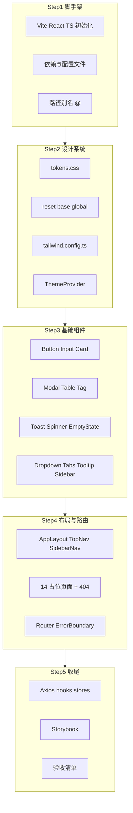

# Phase 0 前端实施计划

> 状态：**已完成**（2026-07-13）

## 文档引用

| 文档 | 路径 | 用途 |
|------|------|------|
| 工程规范 | [开发文档.md](./开发文档.md) | 目录结构、Props、路由、验收标准 |
| UI 视觉规范 | [设计系统规范.md](../汤圆的代码助手_设计系统规范.md) | 色彩、字体、间距、组件外观、布局、图标 |

**文档优先级（冲突时）：**

| 场景 | 以何为准 |
|------|----------|
| 文件结构、Props、路由、技术栈 | `开发文档.md` |
| 颜色语义、布局尺寸、组件视觉、图标尺寸 | `设计系统规范.md` |
| Token 变量名与 CSS 定义 | `开发文档.md` §4.1 |

**已知差异（实施时按设计规范微调视觉，保留 phase0 的 token 命名）：**

- 按钮 md 高度：设计规范 34px vs 开发文档 32px → 采用 **34px**
- 导航 active 指示条：设计规范 **2px** 蓝条 + `--bg-active` 背景 → 采用 **设计规范**
- 字号：设计规范 `--text-sm: 14px` → 采用 **设计规范**

---

## 实施流程总览



---

## Step 1：项目脚手架

**目标：** 在当前仓库根目录初始化可运行的 Vite + React + TS 工程。

**操作：**

```bash
pnpm create vite@latest . --template react-ts
pnpm add react-router-dom zustand axios lucide-react clsx tailwind-merge
pnpm add -D tailwindcss @tailwindcss/vite postcss autoprefixer prettier eslint
```

**关键配置文件：** `vite.config.ts`、`tsconfig.json`、`eslint.config.js`、`.prettierrc`、`.env`、`index.html`（防主题闪烁脚本）

---

## Step 2：设计系统与主题

**目标：** 建立 GitHub Dark 风格 token 体系，Tailwind 与 CSS Variables 双通道引用。

**文件：** `src/styles/tokens.css`、`reset.css`、`base.css`、`global.css`；`src/theme/`（ThemeProvider、themeStore、useTheme）

---

## Step 3：基础组件库 — 13 个组件

| 批次 | 组件 | 设计规范参考 |
|------|------|-------------|
| 1 | Spinner / Skeleton | §8.10 |
| 2 | Button | §8.1（md=34px） |
| 3 | Input | §8.2 |
| 4 | Tag / Badge | §8.6 |
| 5 | Card | §8.3 |
| 6 | EmptyState | §8.9 |
| 7 | Tooltip | §1.1 |
| 8 | Dropdown | §8.4 |
| 9 | Tabs | 底部 accent 指示条 |
| 10 | Modal | §8.4 |
| 11 | Table | §8.5 |
| 12 | Toast 系统 | §8.7 |
| 13 | Sidebar MenuItem | §8.8 |

---

## Step 4：布局框架与路由

- `AppLayout` / `TopNav` / `SidebarNav`（240px ↔ 64px，768px 抽屉）
- 14 占位页面 + 404 + ErrorBoundary
- `createBrowserRouter` 路由表

---

## Step 5：基础设施与异常处理

- `src/lib/axios.ts`、`utils.ts`
- `useClickOutside`、`useMediaQuery`
- 统一错误 Toast

---

## Step 6：Storybook

- 13 个组件 Stories
- dark/light 主题 toolbar 切换

---

## Step 7：验收清单

- [x] `pnpm dev` 无 TS 编译错误，浏览器打开完整 AppLayout
- [x] 所有菜单路由可导航，子菜单可展开/折叠
- [x] 侧边栏 240px ↔ 64px 切换，折叠态 Tooltip 显示 label
- [x] 主题 dark/light 切换，刷新保持，首次跟随系统
- [x] 404 路径显示 NotFoundPage
- [x] `<768px` 侧边栏抽屉模式
- [x] 所有交互元素 keyboard focus 可见
- [x] `pnpm storybook` 可预览 13 个组件
- [x] 全项目 grep 无硬编码 hex 色值（除 tokens.css）

---

## UI 设计规范引用清单

实施任何可见 UI 时，对照 [设计系统规范.md](../汤圆的代码助手_设计系统规范.md)：

| 章节 | 用途 |
|------|------|
| §一 色彩体系 | 背景/文字/边框/语义色 |
| §二 字体规范 | sans/mono、字号行高 |
| §三 间距系统 | 4px 栅格 |
| §四 圆角 | sm/md/lg/xl |
| §五 阴影 | 卡片/弹窗/focus |
| §六 动效 | duration/easing |
| §七 布局规范 | 顶栏/侧栏/断点/max-width |
| §八 基础组件 | 各组件视觉规格 |
| §九 图标规范 | Lucide、16/20/24px |
